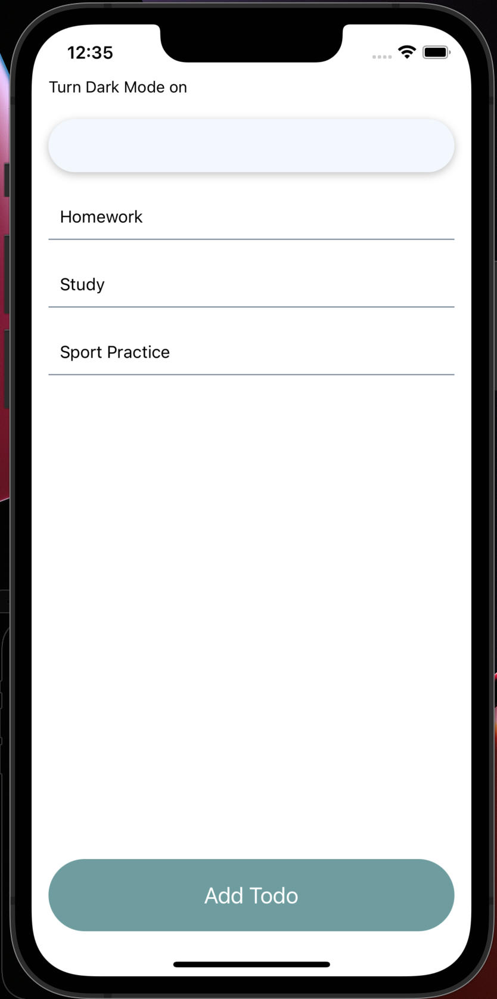
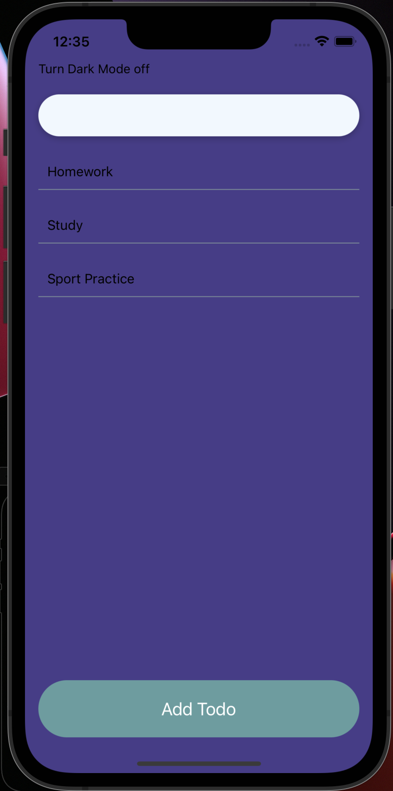
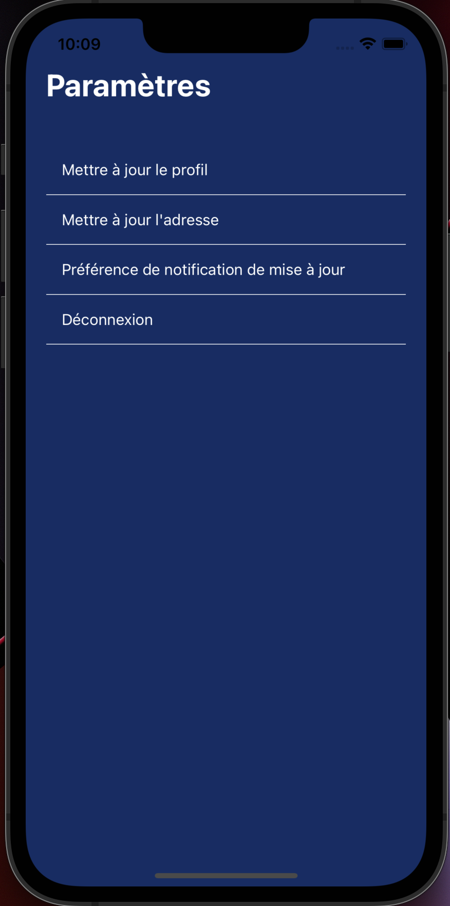

<div id="top"></div>
<!--
*** Thanks for checking out the Best-README-Template. If you have a suggestion
*** that would make this better, please fork the repo and create a pull request
*** or simply open an issue with the tag "enhancement".
*** Don't forget to give the project a star!
*** Thanks again! Now go create something AMAZING! :D
-->


<!-- PROJECT SHIELDS -->
<!--
*** I'm using markdown "reference style" links for readability.
*** Reference links are enclosed in brackets [ ] instead of parentheses ( ).
*** See the bottom of this document for the declaration of the reference variables
*** for contributors-url, forks-url, etc. This is an optional, concise syntax you may use.
*** https://www.markdownguide.org/basic-syntax/#reference-style-links
-->
[![Contributors][contributors-shield]][contributors-url]
<a href="https://www.linkedin.com/in/darronreginaldbrown/">

</a>
<a href="https://www.youtube.com/channel/UC7Cjb-mb8cfkdr_EQwDm97g">

</a>
<a href="https://www.instagram.com/iamdarronbrown/">

</a>


<!-- PROJECT LOGO -->
<br />
<div align="center">
  <a href="https://geekmode.tech">
    
  </a>

<h3 align="center">Welcome Patrons</h3>

  <p align="center">
    You can access all the repos to the projects that are hosted on YouTube!
    <br />
    <br />
  </p>
<div style="justify-content: space-between;" align="center">
    
    
    
</div>
</div>

<!-- ABOUT THE PROJECT -->
## About The Project

This is a React Native application for intermediates. Knowing how to localize your app, making your app available in multiple languages, will separate you 90% of developers. A developer can go their entire career never implementing Localization/i18n.

<p align="right">(<a href="#top">back to top</a>)</p>

### Built With

This section should list any major frameworks/libraries used to bootstrap your project.

* [React](https://reactjs.org/)
* [React Native](https://reactnative.dev/)
* [react-native-localize](https://www.npmjs.com/package/react-native-localize)
* [XCode](https://developer.apple.com/xcode/)
* [Android Studio](https://developer.android.com/studio)

<p align="right">(<a href="#top">back to top</a>)</p>

<!-- GETTING STARTED -->
## Getting Started

To get a local copy up and running follow these simple example steps.

### Prerequisites

React Native should be up and running on your computer.

* [React Native Installation](https://reactnative.dev/docs/environment-setup)

### Installation

_Below is an example of how you can instruct your audience on installing and setting up your app. This template doesn't rely on any external dependencies or services._

1. Clone the repo
   ```sh
   git clone https://github.com/Dabrown18/youtube-projects.git
   ```

2. Change your directory to the project
   ```sh
   cd youtube-projects
   ```

3. Check out the project branch
   ```sh
   git checkout localization
   ```

4. Change your directory to the project
   ```sh
   cd localization
   ```

5. Run the command yarn install or npm install to install dependencies
   ```sh
   yarn install
   ```
   ```sh
   npm install
   ```

6. Change your directory to ios directory and install your pods
   ```sh
   cd ios && pod install
   ```

7. Go back to the project directory and run the command yarn start or npm start to start the metro bundler
   ```sh
   cd .. && yarn start
   ```
   ```sh
   cd .. && npm start
   ```

8. `npx react-native run-ios` is one way to run your app. You can also run it directly from within Xcode.


<p align="right">(<a href="#top">back to top</a>)</p>

<!-- PROJECTS -->
### Projects

Here is a list of all the repos.

* [Project Home](https://github.com/Dabrown18/youtube-projects)
* [Tic Tac Toe](https://github.com/Dabrown18/youtube-projects/tree/tic_tac_toe)
* [Localization](https://github.com/Dabrown18/youtube-projects/tree/localization)

<p align="right">(<a href="#top">back to top</a>)</p>

<!-- CONTACT -->
## Contact

Darron Brown - [@iAmDarronBrown](https://www.instagram.com/iamdarronbrown/) - contact@GeekMODE.tech

Project Link: [https://github.com/Dabrown18/youtube-projects](https://github.com/Dabrown18/youtube-projects)

<p align="right">(<a href="#top">back to top</a>)</p>


<!-- MARKDOWN LINKS & IMAGES -->
<!-- https://www.markdownguide.org/basic-syntax/#reference-style-links -->
[contributors-shield]: https://img.shields.io/github/contributors/othneildrew/Best-README-Template.svg?style=for-the-badge
[contributors-url]: https://github.com/othneildrew/Best-README-Template/graphs/contributors
[forks-shield]: https://img.shields.io/github/forks/othneildrew/Best-README-Template.svg?style=for-the-badge
[forks-url]: https://github.com/othneildrew/Best-README-Template/network/members
[stars-shield]: https://img.shields.io/github/stars/othneildrew/Best-README-Template.svg?style=for-the-badge
[stars-url]: https://github.com/othneildrew/Best-README-Template/stargazers
[issues-shield]: https://img.shields.io/github/issues/othneildrew/Best-README-Template.svg?style=for-the-badge
[issues-url]: https://github.com/othneildrew/Best-README-Template/issues
[license-shield]: https://img.shields.io/github/license/othneildrew/Best-README-Template.svg?style=for-the-badge
[license-url]: https://github.com/othneildrew/Best-README-Template/blob/master/LICENSE.txt
[linkedin-shield]: https://img.shields.io/badge/-LinkedIn-black.svg?style=for-the-badge&logo=linkedin&colorB=555
[linkedin-url]: https://linkedin.com/in/othneildrew
[product-screenshot]: images/screenshot.png
